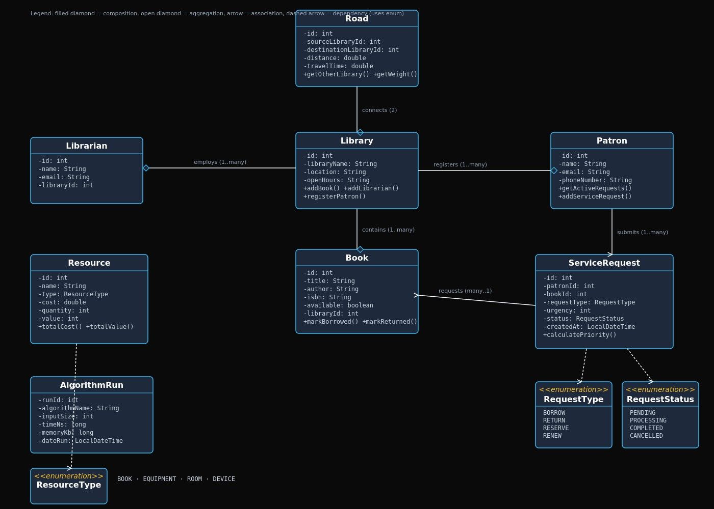

# Ghana Smart Service Operations Optimizer

## Library Management and Decision Support System

**Course:** DCIT 204/308 – Data Structures and Algorithms I & II  
**Selected Ghanaian Context:** Library / Records Office  
**Organisation/Problem Modelled:** Public Library Network in Ghana  
**Team Name:** [To be confirmed]  
**Team Members:** [To be added when confirmed]

---

## 1. Problem Statement
The Ghana Smart Service Operations Optimizer is being developed as a Library Management and Decision Support System for a public library network operating across multiple locations in Ghana. The system is intended to support the management of library records and service operations while applying appropriate data structures and algorithms to practical operational problems.

The library network handles books, patrons, librarians, service requests, resources, and connections between library locations. Its daily operations may involve borrowing and returning books, reserving unavailable books, processing service requests according to urgency or priority, searching and sorting records, and determining suitable routes between connected library branches.

Managing these operations efficiently requires more than permanent storage of records. The system must be able to load stored data into custom-built data structures and apply algorithms that support efficient searching, sorting, scheduling, routing, connectivity analysis, and resource allocation. It must also preserve operational data in a database so that information can be stored and retrieved across different executions of the application.

The project therefore aims to design and implement a library management and decision support system that integrates a database with custom data structures and algorithms. The system will provide a practical environment for evaluating the correctness and efficiency of different algorithmic approaches while addressing realistic library service operations within a Ghanaian context.

## 2. Assumptions, Input-Output Definitions and System Boundaries
### 2.1 Assumptions

The system is designed based on the following assumptions:

- Each library branch, book, patron, service request, resource, road and algorithm run has a unique identifier.
- Library records are stored persistently in the project database and can be reloaded when the application starts.
- The library branches form a network in which roads or connections between locations have associated weights such as distance, travel time or road-condition weight.
- Service requests contain sufficient information to determine their urgency, priority and processing order.
- Resources available to the library network have defined capacities and availability statuses.
- Search operations that require ordered data, such as binary search, are performed only after the relevant records have been sorted.
- Graph operations may encounter disconnected locations or locations for which no valid route exists, and the system must handle these cases appropriately.
- The application operates on valid library data while also checking boundary and invalid-input cases through testing.
### 2.2 Input Definitions

The major inputs to the system include:

- **Library and location data:** identifiers, names, areas, location types and coordinates.
- **Road/network data:** origin location, destination location, distance, travel time and road-condition weight.
- **Book and patron records:** information required to identify and manage books and library users.
- **Service requests:** source, destination, category, urgency, submission time, deadline and status.
- **Resource data:** resource identifier, type, home location, capacity and availability status.
- **Algorithm parameters:** search keys, sorting criteria, source and destination locations, priority values, capacity or budget constraints, and experiment input sizes.
### 2.3 Output Definitions

Depending on the operation selected, the system may produce:

- the next service request to be processed under FIFO, urgency or priority-based rules;
- search results for books, patrons, requests, locations or resources;
- sorted records produced by the implemented sorting algorithms;
- reachable library locations and traversal orders produced by BFS or DFS;
- the shortest route between two connected locations using Dijkstra's algorithm;
- a minimum connection network and its total cost using Prim's or Kruskal's algorithm;
- a selected subset of requests or resources under a specified capacity, budget or time constraint;
- database records and operational logs; and
- algorithm performance results, including runtime and memory measurements for different input sizes.
### 2.4 System Boundaries

The system focuses on the data-structure, algorithmic and database requirements of managing a Ghanaian public library network. It includes persistent storage and retrieval of operational records, custom data-structure implementations, searching and sorting, request scheduling, graph-based routing and connectivity, optimisation, correctness testing and empirical performance analysis.

The project does not focus on developing a complex graphical user interface. A console menu or simple graphical interface is sufficient for demonstrating the required operations. The system also does not attempt to model every activity performed by a real public library. Its scope is limited to the records and operational problems required to demonstrate the specified data structures, algorithms, database integration, testing and performance analysis.

## 3. Dataset Description and Data Dictionary

### 3.1 Dataset Description

The dataset represents the information required to operate and analyse a network of public libraries in Ghana. It supports both normal library-management activities and the algorithmic operations required by the project.

The data is organised around library branches, the road connections between them, librarians, patrons, books, service requests, available resources and records of algorithm experiments. These entities are stored persistently in an SQLite database and are loaded by the application when required for processing.

The `libraries` table represents individual library branches and provides the locations that form the nodes of the library network. The `roads` table represents weighted connections between these branches using distance and travel time. Together, these tables provide the data required for graph-based operations such as traversal, shortest-path computation and minimum spanning tree analysis.

The `books`, `patrons` and `librarians` tables represent the main records involved in normal library operations. Books are associated with particular library branches, while librarians are also assigned to libraries. Service requests connect patrons with books and contain information such as request type, urgency, status and creation time. This allows requests to be searched, sorted, queued and prioritised using the project's custom data structures and algorithms.

The `resources` table stores resources that may be considered during allocation and optimisation operations. Finally, the `algorithm_runs` table stores empirical performance measurements, including algorithm name, input size, execution time and memory usage. These records provide evidence for comparing theoretical algorithmic complexity with observed performance.

### 3.2 Data Dictionary

| Table | Field | Data Type | Description |
|---|---|---|---|
| `libraries` | `id` | INTEGER | Unique automatically generated identifier for a library branch. |
| `libraries` | `library_name` | TEXT | Name of the library branch. |
| `libraries` | `location` | TEXT | Location of the library. |
| `libraries` | `open_hours` | TEXT | Operating hours of the library. |
| `roads` | `id` | INTEGER | Unique identifier for a road connection. |
| `roads` | `source_library_id` | INTEGER | Library at which the road connection begins. |
| `roads` | `destination_library_id` | INTEGER | Library at which the road connection ends. |
| `roads` | `distance` | REAL | Distance between the two connected libraries. |
| `roads` | `travel_time` | REAL | Travel time between the connected libraries. |
| `librarians` | `id` | INTEGER | Unique identifier for a librarian. |
| `librarians` | `name` | TEXT | Librarian's name. |
| `librarians` | `email` | TEXT | Librarian's email address. |
| `librarians` | `library_id` | INTEGER | Library branch to which the librarian is assigned. |
| `patrons` | `id` | INTEGER | Unique identifier for a library patron. |
| `patrons` | `name` | TEXT | Patron's name. |
| `patrons` | `email` | TEXT | Patron's email address. |
| `patrons` | `phone_number` | TEXT | Patron's telephone number. |
| `books` | `id` | INTEGER | Unique identifier for a book record. |
| `books` | `title` | TEXT | Title of the book. |
| `books` | `author` | TEXT | Author of the book. |
| `books` | `isbn` | TEXT | ISBN associated with the book. |
| `books` | `available` | INTEGER | Indicates whether the book is currently available. |
| `books` | `library_id` | INTEGER | Library branch where the book is held. |
| `service_requests` | `id` | INTEGER | Unique identifier for a service request. |
| `service_requests` | `patron_id` | INTEGER | Patron who made the request. |
| `service_requests` | `book_id` | INTEGER | Book associated with the request. |
| `service_requests` | `request_type` | TEXT | Type of library service being requested. |
| `service_requests` | `urgency` | INTEGER | Urgency level assigned to the request. |
| `service_requests` | `status` | TEXT | Current status of the request. |
| `service_requests` | `created_at` | TEXT | Date/time at which the request was created. |
| `resources` | `id` | INTEGER | Unique identifier for a resource. |
| `resources` | `name` | TEXT | Name of the resource. |
| `resources` | `type` | TEXT | Category or type of resource. |
| `resources` | `cost` | REAL | Cost associated with the resource. |
| `resources` | `quantity` | INTEGER | Quantity of the resource available. |
| `resources` | `value` | INTEGER | Value assigned to the resource for optimisation decisions. |
| `algorithm_runs` | `id` | INTEGER | Unique identifier for an algorithm experiment. |
| `algorithm_runs` | `algorithm_name` | TEXT | Name of the algorithm tested. |
| `algorithm_runs` | `input_size` | INTEGER | Number of input elements used in the experiment. |
| `algorithm_runs` | `time_ns` | INTEGER | Execution time measured in nanoseconds. |
| `algorithm_runs` | `memory_kb` | INTEGER | Memory consumption measured in kilobytes. |
| `algorithm_runs` | `date_run` | TEXT | Date on which the experiment was performed. |

### 3.3 Database Relationships

Foreign-key relationships are used to maintain connections between related records. The `roads` table references the `libraries` table through both `source_library_id` and `destination_library_id`, allowing library branches to form a graph of connected locations. The `librarians.library_id` and `books.library_id` fields associate librarians and books with their respective library branches.

The `service_requests` table references both `patrons` and `books`. This connects each service request to the patron who submitted it and the book involved in the request.

Foreign-key enforcement is enabled in SQLite to help preserve referential integrity between these related records.

## 4. System Architecture and Module Design

### 4.1 Architecture Overview

The Library Management and Decision Support System is organised into cooperating components that separate the system's domain data, persistent storage, custom data structures, algorithms and user interaction. This separation allows the application to store library records permanently while still loading and processing those records using the custom data structures and algorithms required by the project.

At the domain level, the system models the main entities involved in the library network, including libraries, books, librarians, patrons, service requests, roads, resources and algorithm runs. These objects provide the data on which the database, data structures and algorithms operate.

The database layer provides persistent storage using SQLite. Records are stored in relational tables and retrieved by the Java application when required. The database therefore serves as the permanent source of operational data, while the custom data-structure layer provides the in-memory representations required for algorithmic processing.

The algorithm and data-structure components operate on the loaded data to support searching, sorting, service-request scheduling, graph traversal, route optimisation, resource allocation and performance analysis. The application's controller and user-interface components coordinate these operations and present their results to the user.

### 4.2 Domain Model

The system's domain model contains the following major entities:

- **Library:** represents a library branch in the network. A library can contain multiple books, employ librarians and register patrons.
- **Book:** represents a book held by a library branch and contains information such as title, author, ISBN and availability.
- **Librarian:** represents a staff member associated with a library.
- **Patron:** represents a registered library user who can submit service requests.
- **ServiceRequest:** represents an operational request associated with a patron and a book. Requests contain a request type, urgency level, status and creation time.
- **Road:** represents a connection between two library locations and stores values such as distance and travel time.
- **Resource:** represents an available library resource with a type, cost, quantity and value.
- **AlgorithmRun:** represents the results of an algorithm performance experiment, including the algorithm name, input size, execution time, memory usage and date of execution.

The model also uses enumerations to restrict selected attributes to recognised values. `RequestType` identifies operations such as BORROW, RETURN, RESERVE and RENEW, while `RequestStatus` represents states such as PENDING, PROCESSING, COMPLETED and CANCELLED. `ResourceType` categorises resources such as BOOK, EQUIPMENT, ROOM and DEVICE.

### 4.3 Relationships Between Core Entities

The UML model illustrates the main relationships between the system's domain entities. A library employs one or more librarians, contains one or more books and registers patrons. Roads connect library branches and provide the weighted connections required to model the library network as a graph.

A patron can submit multiple service requests, while each service request refers to a book involved in the requested operation. These relationships allow the application to model realistic library activities while providing suitable data for queueing, priority scheduling, searching and sorting.

The road-to-library relationship also allows graph algorithms to operate on the network of library branches. Libraries act as vertices, while roads act as weighted edges between them.

### 4.4 Database and Application Integration

SQLite is used as the persistent database for the system. The Java database layer creates and accesses the required tables and provides the connection between persistent records and the application's domain objects.

When data is required for an operation, records can be retrieved from the database and converted into the appropriate Java objects. These objects can then be loaded into the project's custom data structures for processing. Results that require persistence, including operational records and algorithm performance measurements, can subsequently be stored in the database.

This approach keeps database storage separate from the assessed algorithmic logic. The database is responsible for persistence, while the custom data structures and algorithms are responsible for the required computational operations.

### 4.5 Data-Structure and Algorithm Layer

The system uses custom implementations of the required data structures rather than relying on Java's built-in collection classes for assessed core operations. These structures support different parts of the library system.

Linear structures such as linked lists, stacks, queues, circular queues and deques support sequential records, history and request processing. Priority queues and heaps support urgency-based dispatch. Trees and hash tables support efficient indexing and lookup. Graph structures represent the network of library branches, while disjoint sets support connectivity and minimum-spanning-tree operations.

Algorithms operating on these structures include linear and binary search, selection sort, insertion sort, merge sort, quicksort, BFS, DFS, Dijkstra's shortest-path algorithm, Prim's algorithm and Kruskal's algorithm. Greedy and dynamic-programming approaches are also used for appropriate optimisation problems.

### 4.6 Application Interaction

The application layer coordinates interaction between the user and the system's underlying services. Through the application's menu or graphical interface, an examiner or user can initiate operations without directly modifying the source code.

A typical operation follows this general flow:

1. The user selects an operation through the application interface.
2. The controller receives the request and obtains the required records.
3. Persistent records are retrieved from the SQLite database where necessary.
4. The records are loaded into the appropriate custom data structure.
5. The selected algorithm processes the data.
6. Results are returned to the application for display.
7. Relevant changes or algorithm-performance results are written back to persistent storage where required.

This architecture allows the database, custom data structures, algorithms and application interface to work together while remaining logically separated.

### 4.7 UML Domain Diagram

The UML diagram below presents the principal domain entities and their relationships.

**Figure 1: UML domain model for the Library Management and Decision Support System.**